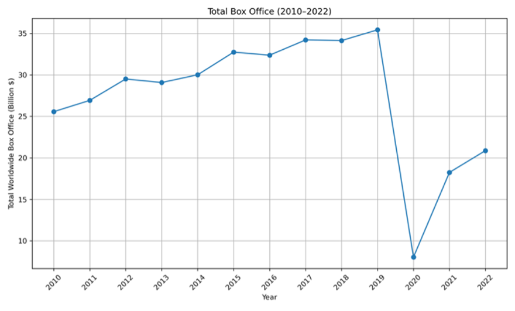
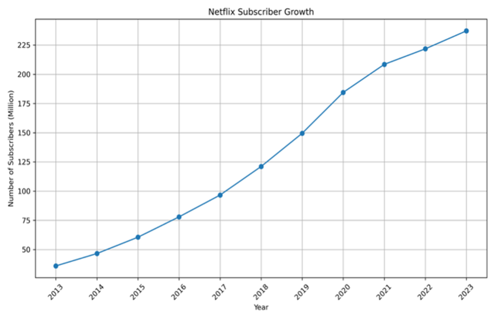
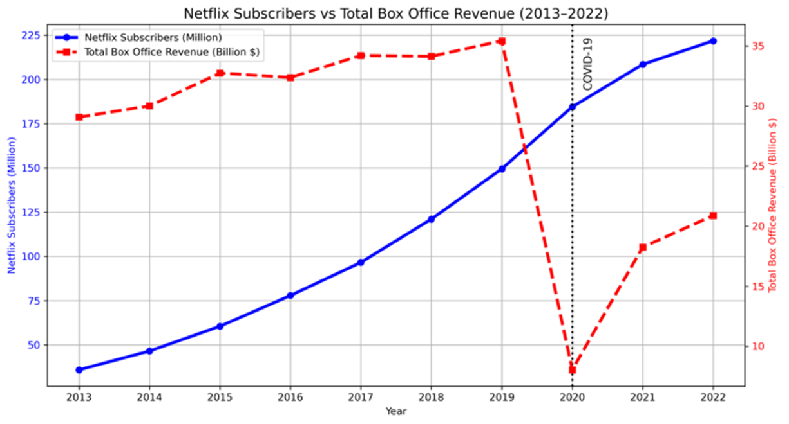

# Cinema vs Streaming Platforms: Structural Revenue Shift Analysis

## Project Overview
This project investigates the structural transformation in the entertainment industry by comparing global box office revenue trends with Netflix subscriber growth data.

The objective is to evaluate whether the post-COVID stagnation in cinema performance reflects a long-term competitive substitution effect driven by streaming platforms.

## Tools Used
- Python
- Pandas
- Matplotlib
- Jupyter Notebook

## Data Sources
- Kaggle: Movies Box Office Collection Data (2000–2024)
- Kaggle: Netflix Customer Subscription Dataset
## Visual Outputs

### Chart 1: Total Box Office Revenue (2010–2022)

### Chart 2: Netflix Subscriber Growth (2013–2023)

### Chart 3: Netflix Subscribers vs Total Box Office Revenue (2013–2022)

